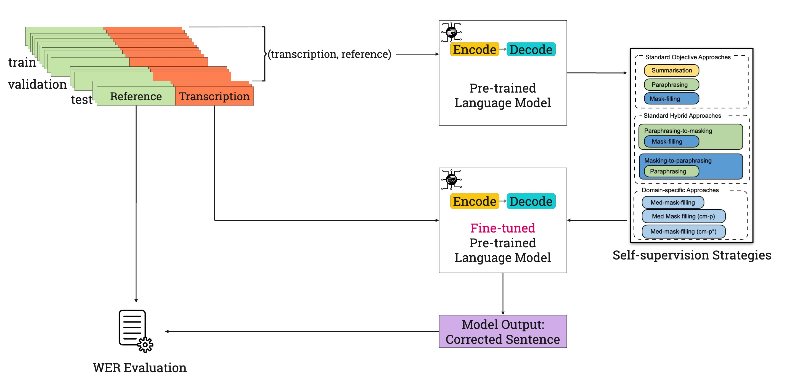

# Clinical Dialogue Transcription Error Correction with Self-supervision

In this work, we introduce self-supervision strategies for clinical dialogue transcription error correction. The following diagram provides an overview of the architecture used in this approach. This architecture leverages seq2seq models, including T5 and BART, fine-tuned with domain-specific data and optimized for tasks aligned with transcription error correction.



## Experiment Setup

To compare the different self-supervision strategies we used two pre-trained language models, [T5](https://dl.acm.org/doi/abs/10.5555/3455716.3455856) and [BART](https://aclanthology.org/2020.acl-main.703).

Pre-trained language models were fine-tuned using [Hugging Face](https://huggingface.co) and [PyTorch](https://pytorch.org) libraries while maintaining all default hyper-parameters. 

For the summarisation task, the encoder input and decoder output sequence lengths were set to 1024 and 128, respectively; for paraphrasing and mask-filling tasks, both encoder input and decoder sequence lengths were set to 512. 

## Datasets

`train` data contains the PubMed abstracts generated for the three self-supervision tasks (Standard, Hybrid and Domain-specific objectives).
`test` data contains the role playing clinical conversations provided by the NHS Grampian (Please note that this dataset will be available upon request).

Note: The fine-tuned models and the train dataset are available on Hugging Face as part of a collection [EC-SelfSupervision](https://huggingface.co/collections/gayanin/ec-selfsupervision-670bf216ce59b1578be165c7). To access and use them, visit the collection and download or load the models and datasets directly into your environment.

## Reproduce Results

This codebase contains the jupyter notebook implementations for language model fine-tuning, WER evaluation and results generation and the notebooks are avaialble in the `notebooks` directory.

The fine-tuned models and the `train` dataset are currently avaialable in the Huggingface hub, however due to the anonimity requirement we have uploaded all the fine-tuned models and datasets to the folllowing Google Drive link: 
(https://drive.google.com/drive/folders/1a5HHaCJ-zRmhfd6HNlFRF9mZ1MEkeFcl?usp=sharing). 

To use the models and datasets please extract them from the Google Drive to the `models` and `datasets` directories respectively.

## Download Dependencies

```
pip3 install -r requirements.txt  
```

## Citation
```
 @article{Nanayakkara2023b,
    title = {Clinical Dialogue Transcription Error Correction with Self-supervision},
    author = {Nanayakkara, Gayani and Wiratunga, Nirmalie and Corsar, David and Martin, Kyle and Wijekoon, Anjana},
    bookTitle="Artificial Intelligence XL",
    year="2023",
    publisher="Springer Nature Switzerland",
    doi="0.1007/978-3-031-47994-6_3"
}
```

**Note**: Older code can be found in [[clinical-error-correction](https://github.com/gayaninan/clinical-error-correction)].
